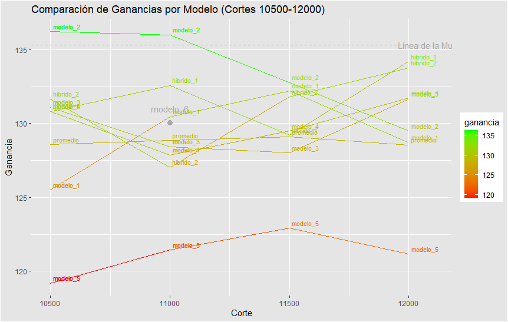

# Competencia 03

## Instrucciones

(Semilla: 945799) -- Dataset con clase ternaria creado a partir de clase_ternaria3.r

## Modelos Experimentados

#### Todos los modelos sacan 202004, 202003 del TS del default del 990, tienen undersampling de 0.2, 20 iteraciones de BO, y 50 de semillerio, sin canaritos. Resto igual al 990.

* Modelo 1: 990_workflow_competencia3_modelo1.r (VM 512 GB RAM 24 vCPU) | FeIntraCreacionismo + FeHistL1y2T1 + FeRf25 
* Modelo 2: 990_workflow_competencia3_modelo2.r (VM 512 GB RAM 24 vCPU) | FeIntraCreacionismo + FeHistL1y2T1y2 + FeRf25  
* Modelo 3: 990_workflow_competencia3_modelo3.r (VM 512 GB RAM 24 vCPU) | FeIntraBase + FeHistL1y2T1y2 + FeRf25  
* Modelo 4: 990_workflow_competencia3_modelo4.r (VM 512 GB RAM 24 vCPU) | FeIntraCreacionismoPlus + FeHistL1y2T1y2 + FeRf25  
* Modelo 5: 990_workflow_competencia3_xgb.r (VM 512 GB RAM 24 vCPU)     | FeIntraCreacionismo + FeHistL1y2T1y2 + FeRf25 + XGBoost 
* Modelo 6: lineademuerte_xgb.r (VM 64 GB 8 vCPU)                       | Línea de la Muerte pero con XGBoost

* Línea la Muerte (VM 32 GB 8 vCPU)

## Hibridaciones Experimentadas

#### Ver código /src/hibridaciones/competencia3_hibrido.r

* Híbrido 1: Modelo1 + Modelo2 + Modelo3 + Modelo4 + Modelo5
* Híbrido 2: Modelo1 + Modelo2 + Modelo3 + Modelo4

### Entrega seleccionada: 
* MODELO 2 (Corte 1100) KA-0005_01_016_r1_11000.csv 
  
