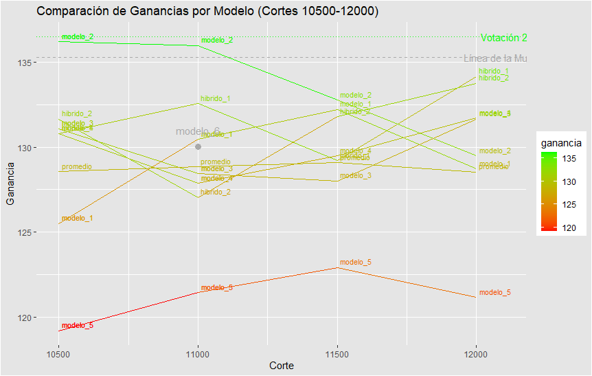

# Competencia 03

## Instrucciones

(Semilla: 945799) -- Dataset con clase ternaria creado a partir de clase_ternaria3.r

## Modelos Experimentados

#### Todos los modelos del 1 al 5 sacan 202004, 202003 del TS del default del 990, tienen undersampling de 0.2, 20 iteraciones de BO, y 50 de semillerio, sin canaritos. Resto igual al 990.

* Modelo 1: 990_workflow_competencia3_modelo1.r (VM 512 GB RAM 24 vCPU) | FeIntraCreacionismo + FeHistL1y2T1 + FeRf25
  * https://github.com/codewithpatelo/dmeyf2024/blob/main/src/workflows/990_workflow_competencia3_modelo1.r
  * https://github.com/codewithpatelo/dmeyf2024/blob/main/src/wf-etapas/1301_FE_intrames_manual_creacionismo.r
* Modelo 2: 990_workflow_competencia3_modelo2.r (VM 512 GB RAM 24 vCPU) | FeIntraCreacionismo + FeHistL1y2T1y2 + FeRf25
  * https://github.com/codewithpatelo/dmeyf2024/blob/main/src/workflows/990_workflow_competencia3_modelo2.r
  * https://github.com/codewithpatelo/dmeyf2024/blob/main/src/wf-etapas/1301_FE_intrames_manual_creacionismo.r
* Modelo 3: 990_workflow_competencia3_modelo3.r (VM 512 GB RAM 24 vCPU) | FeIntraBase + FeHistL1y2T1y2 + FeRf25
  * https://github.com/codewithpatelo/dmeyf2024/blob/main/src/workflows/990_workflow_competencia3_modelo3.r
* Modelo 4: 990_workflow_competencia3_modelo4.r (VM 512 GB RAM 24 vCPU) | FeIntraCreacionismoPlus + FeHistL1y2T1y2 + FeRf25  
  * https://github.com/codewithpatelo/dmeyf2024/blob/main/src/workflows/990_workflow_competencia3_modelo4.r
  * https://github.com/codewithpatelo/dmeyf2024/blob/main/src/wf-etapas/1301_FE_intrames_manual_creacionismoplus.r
* Modelo 5: 990_workflow_competencia3_xgb.r (VM 512 GB RAM 24 vCPU)     | FeIntraCreacionismo + FeHistL1y2T1y2 + FeRf25 + XGBoost 
  * https://github.com/codewithpatelo/dmeyf2024/blob/main/src/workflows/990_workflow_competencia3_modelo4.r
  * https://github.com/codewithpatelo/dmeyf2024/blob/main/src/wf-etapas/1301_FE_intrames_manual_creacionismo.r
  * https://github.com/codewithpatelo/dmeyf2024/blob/main/src/wf-etapas/2212_HT_xgboost_SEMI.r
  * https://github.com/codewithpatelo/dmeyf2024/blob/main/src/wf-etapas/2302_FM_final_models_xgboost_SEMI.r
  * https://github.com/codewithpatelo/dmeyf2024/blob/main/src/wf-etapas/2402_SC_scoring_xgboost_SEMI.r
* Modelo 6: lineademuerte_xgb.r (VM 64 GB 8 vCPU)                       | Línea de la Muerte pero con XGBoost
  * https://github.com/codewithpatelo/dmeyf2024/blob/main/src/lineademuerte/lineademuerte_xgb.r

* Línea la Muerte (VM 32 GB 8 vCPU)
  * https://github.com/codewithpatelo/dmeyf2024/blob/main/src/lineademuerte/lineademuerte.r

## Hibridaciones Experimentadas

#### Ver código https://github.com/codewithpatelo/dmeyf2024/blob/main/src/hibridaciones/competencia3_hibrido.R
* Híbrido 1: Promedios (Modelo1 + Modelo2 + Modelo3 + Modelo4 + Modelo5)
* Híbrido 2: Promedios (Modelo1 + Modelo2 + Modelo3 + Modelo4)

## Votaciones Experimentadas

#### Ver código https://github.com/codewithpatelo/dmeyf2024/blob/main/src/hibridaciones/competencia3_votaciones.r

* Votación 1: Moda Predicted (Modelo1, Modelo2, Modelo3, Modelo4, Modelo5, Modelo6, Híbrido1, Híbrido2, LíneaDeMuerte) 
* Votación 2: Moda Predicted (Modelo2[10500, 11000, 11500], Modelo3[12000], Híbrido1[12000, 12500], Híbrido2[9500, 10000, 12000, 12500], LíneaDeMuerte)

### Entrega seleccionada: 
* Votación 2: *super_votacion_kaggle_buenos.csv*
  
